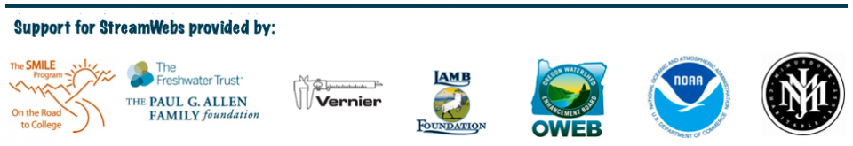

.. _about:

=====
About
=====

StreamWebs is a dynamic networking platform that links students with locally
based hands-on  watershed stewardship projects and provides a multimedia
showcase for their project and data reports. StreamWebs offers teachers and
community partners resources to support setting students on the path to
lifelong watershed stewardship. By providing students and teachers open-source,
web-based tools for watershed data management, analysis, and networking,
StreamWebs supports classrooms in their pursuit of STEM (Science, Technology,
Engineering, Mathematics) educational opportunities, while helping students and
teachers demonstrate their role as vital contributors to watershed
sustainability. StreamWebs originated in 2008 as a project of The Freshwater
Trust.  In 2011, StreamWebs transitioned to Oregon State University Extension
Service.

Oregon State University's `Open Source Lab`_ is currently remaking the site. 

For more information, please visit the original StreamWebs site `here`_, or
send an email to StreamWebs@oregonstate.edu.

.. _Open Source Lab: http://osuosl.org/contact

.. _here: http://www.streamwebs.org/

